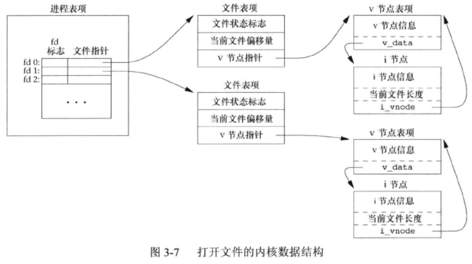
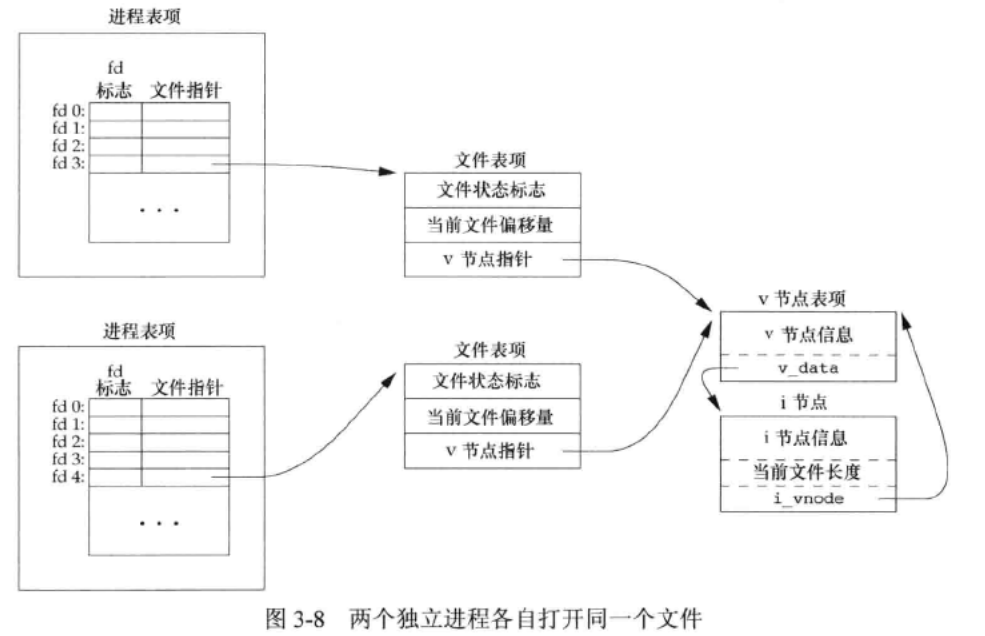
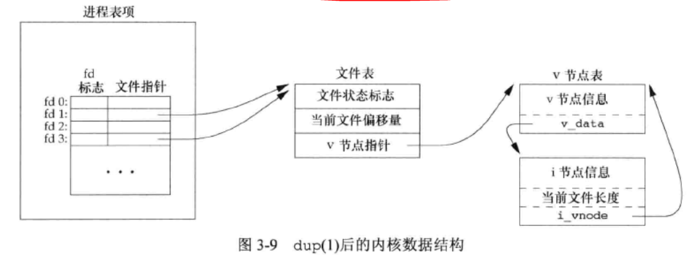

<!--
 * @Author: your name
 * @Date: 2021-01-29 21:31:27
 * @LastEditTime: 2021-01-30 17:11:11
 * @LastEditors: Please set LastEditors
 * @Description: In User Settings Edit
 * @FilePath: \apue.3e\fileio\learnbook.md
-->
# 3 文件IO
文件IO又经常被称为不带缓冲的IO，大多数的文件IO只需要5个函数`open read write lseek close`。


对于内核而言，所有打开的文件都通过文件描述符引用。

## 3.10 文件共享
内核使用3种数据结构表示打开文件，分别是进程表项、文件表项、V节点表项，它们之间的关系如下图所示,


如果两个独立进程各自打开了同一个文件，则有如下图所示的关系


## 3.11 原子操作
原子操作（atomic operation）指的是由多步组成的一个操作。如果该该操作原子地执行，则要么执行完所有步骤，要么一步也不执行，不可能只执行所有步骤的一个子集。

## 3.12 dup和dup2
由dup返回的新文件描述符一定是当前可用文件描述符中的最小数值。对于dup2，可以用fd2参数指定新描述符的值。这些函数返回的新文件描述符与参数fd共享同一个文件表项，如下图所示
```C++
int dup(int fd);
int dup2(int fd,int fd2);
```


## 3.13 sync、fsync和fdatasync
向文件写入数据时，内核通常先将数据复制到缓冲区，然后排入队列，晚些时候再写入磁盘。当内核需要重用缓冲区来存放其他磁盘块数据时，它会把所有延迟写数据块写入磁盘，为保证磁盘上市级文件系统与缓冲区内容一致，UNIX提供了sync、fsync和fdatasync三个函数。

## 3.14 fcntl
fnctl可以改变已经打开文件的属性。
```C++
int fcntl(int fd,int cmd,.../* int arg */);
```
